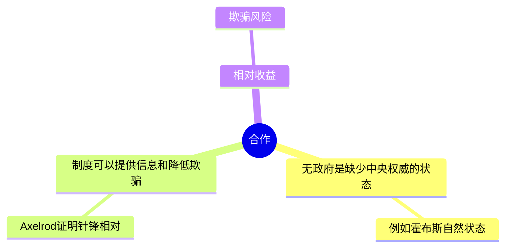

# 不合格｜细节进节点

## 2.2 知识框架图

```mermaid
mindmap
  root((合作))
    无政府是缺少中央权威的状态
      例如霍布斯自然状态
    制度可以提供信息和降低欺骗
      Axelrod证明针锋相对
    相对收益
      欺骗风险
```

- 无政府是缺少中央权威的状态
  - 例如霍布斯自然状态
- 制度可以提供信息和降低欺骗
  - Axelrod证明针锋相对
- 相对收益
  - 欺骗风险
