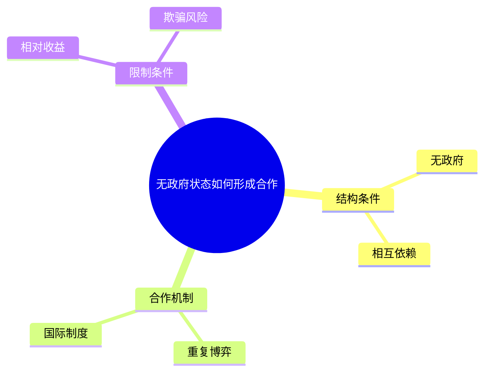

# 不合格｜有时间轴但无线索问题

## 1. 课程主题
核心问题：无政府状态下国家如何形成稳定合作？

## 2. 课堂结构重建
### 2.1 原初推进路线

| 定位 | 课堂阶段 | 对应小节 |
| --- | --- | --- |
| P001–P010 | 引入 | 3.1 |
| P011–P020 | 机制 | 3.2 |

### 2.2 知识框架图

- 结构条件
  - 无政府
  - 相互依赖
- 合作机制
  - 重复博弈
  - 国际制度
- 限制条件
  - 相对收益
  - 欺骗风险

## 3. 分节内容

### 3.1 引入
来源：P001–P010
无政府状态下合作如何可能，由贸易摩擦提出。

### 3.2 机制
来源：P011–P020
重复博弈与国际制度被并列提出。
