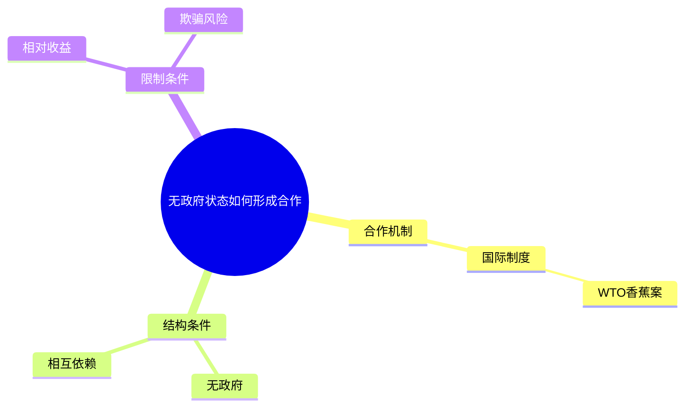

# 不合格｜第三层例子

## 2.2 知识框架图

```mermaid
mindmap
  root((无政府状态如何形成合作))
    合作机制
      国际制度
        WTO香蕉案
    结构条件
      无政府
      相互依赖
    限制条件
      相对收益
      欺骗风险
```

- 合作机制
  - 国际制度
    - WTO香蕉案
- 结构条件
  - 无政府
  - 相互依赖
- 限制条件
  - 相对收益
  - 欺骗风险
