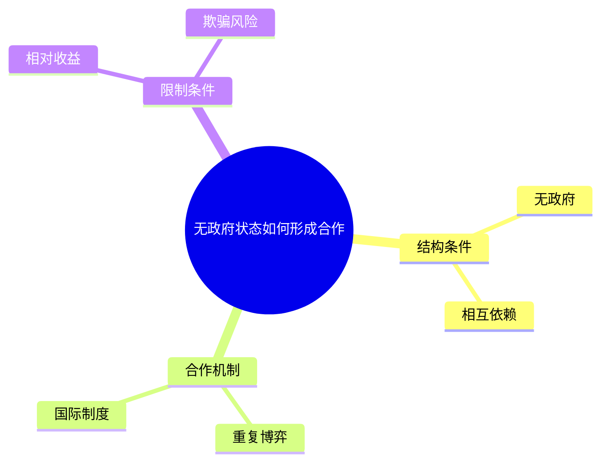

# 国际合作｜无政府状态如何形成合作

## 1. 课程主题
本节要义：缺少中央权威并不等于合作不可能；合作靠重复交往与制度提供的信息，并受相对收益限制。
核心问题：无政府状态下国家如何形成稳定合作？

## 2. 课堂结构重建
### 2.1 原初推进路线

| 定位 | 课堂阶段 | 对应小节 |
| --- | --- | --- |
| P001–P008 | 贸易摩擦引入 | 3.1 |
| P009–P018 | 无政府与相互依赖 | 3.2 |
| P019–P028 | 重复博弈与国际制度 | 3.3 |
| P029–P034 | 相对收益插叙 | 3.4 |

### 2.2 知识框架图

- 结构条件
  - 无政府
  - 相互依赖
- 合作机制
  - 重复博弈
  - 国际制度
- 限制条件
  - 相对收益
  - 欺骗风险

跨枝关系：

- 相对收益可理解为限制国际制度的条件（原文未证明为唯一因果）

## 3. 分节内容（沿实际讲授顺序）

### 3.1 用贸易摩擦引入合作问题
本节问题：具体争端如何提出无政府下的合作问题？
来源：P001–P008

讨论由贸易摩擦转入理论问题。案例在此处提出问题，而不是证明普遍规律（P003）。

### 3.2 无政府与相互依赖
本节问题：相互依赖为何不能单独推出合作？
来源：P009–P018

无政府指缺少强制执行契约的中央权威（P012）。相互依赖提高欺骗成本，但不等于合作自动出现（P016）。

### 3.3 重复博弈与国际制度
本节问题：重复博弈与制度如何分别约束欺骗？
来源：P019–P028

重复博弈强调未来交往对当前欺骗的约束（P021）。国际制度用来提供信息与监督（P025）。两条机制并列，原文没有比较强弱。

### 3.4 相对收益作为限制
本节问题：相对收益在何种条件下限制合作？
来源：P029–P034

若对方相对获益更多，行为者可能拒绝合作（P031）。课堂把它当作限制条件提出，没有完成从该前提到制度必然失败的证明。

## 6. 逻辑跳跃与未讲清之处
相对收益如何必然压过制度提供的信息，原文未说明。
