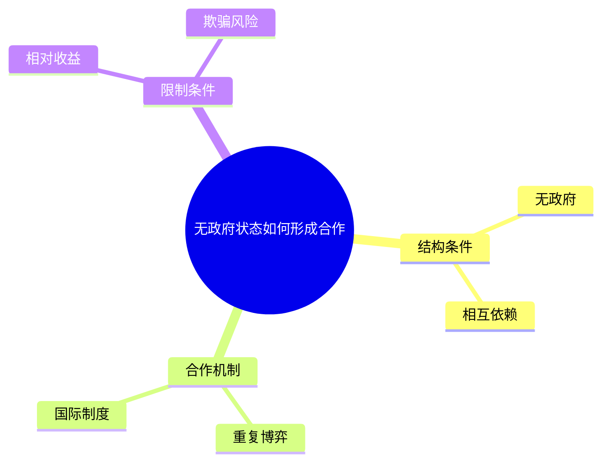
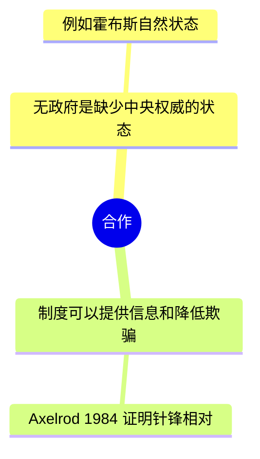

# 知识框架图：合格与不合格

本文件给写图时对照。硬限制以 `SKILL.md` 为准。

图的工作是 Novak / Cañas 的 **expert skeleton**：6–16 个节点、一层好的层级、回答一个 focus question。详细命题、链接短语和例子留在课堂实录正文。Eppler（2006）把 mind map 放在“域的子题一览”，把 concept map 放在“系统关系”；本 skill 取前者做导航，取后者的约束（一问、层级、短标签）防止胀成第二份笔记。

## 合格

核心问题：无政府状态下国家如何形成稳定合作？



- 结构条件
  - 无政府
  - 相互依赖
- 合作机制
  - 重复博弈
  - 国际制度
- 限制条件
  - 相对收益
  - 欺骗风险

跨枝关系：

- 相对收益可理解为限制国际制度的条件（原文未证明为唯一因果）

这张图能扫完本节骨架；“重复博弈如何降低欺骗”写在正文。

## 不合格：细节进节点



失败原因：根不是问句；节点是定义和论证；出现例子与文献；深度和字数都破限。

## 不合格：按讲授顺序复制提纲

把 2.1「先讲案例 → 再定义 → 再回到案例」原样画成枝。框架图要按概念层级归类；时间顺序只留在 2.1。

## 不合格：第三层例子

`合作机制 → 国际制度 → WTO 争端解决的香蕉案`。案例名属于正文。

## 门禁

对写成的笔记跑：

```bash
python3 scripts/check_framework_map.py path/to/note.md
python3 scripts/check_note.py path/to/note.md
```

聚合门禁：

```bash
bash scripts/run_eval.sh
```
